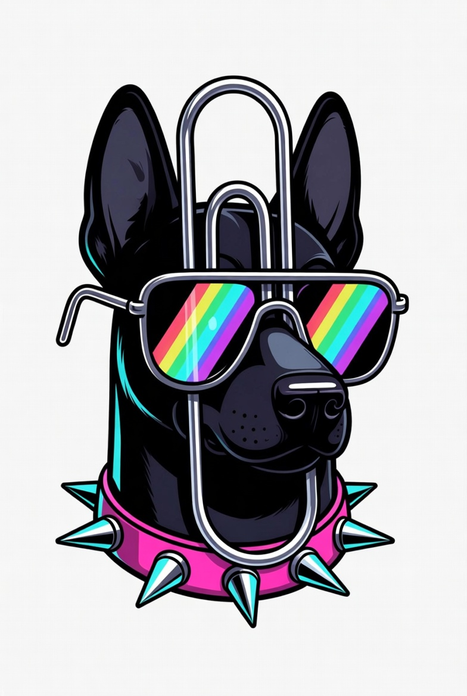

# Clipd

A lightweight, native macOS menu bar app for recording your screen as GIFs. Perfect for creating product demos, bug reports, tutorials, and sharing quick screen captures.

<p align="center">
  <a href="https://github.com/danfarrdotcom/clipd/actions/workflows/ci.yml">
    
  </a>
  <a href="https://testflight.apple.com/join/YOUR_INVITE_CODE">
    
  </a>
</p>



## Features

- **Region Selection** — Drag to select any area of your screen
- **Multi-Source Recording** — Record region, window, application, or full display
- **GIF & MP4 Export** — Choose your output format
- **Background Styles** — Solid color, gradient, transparent, or rounded corners
- **Device Frame Overlays** — iPhone and MacBook frames for polished presentations
- **GIF Optimization** — Auto-optimizes with gifsicle if installed
- **Menu Bar App** — Always accessible, no dock icon
- **Global Hotkey** — `Cmd+Shift+4` to start recording instantly
- **Auto-Updates** — Built-in Sparkle updater

## Installation

### Direct Download

Download the latest release from the [Releases](https://github.com/danfarrdotcom/clipd/releases) page.

### TestFlight (Beta)

[Join the beta](https://testflight.apple.com/join/YOUR_INVITE_CODE)

### Homebrew

```bash
brew install --cask clipd
```

### Build from Source

```bash
git clone https://github.com/danfarrdotcom/clipd.git
cd clipd
make build
```

## Usage

1. Launch Clipd from your menu bar
2. Click the record icon or press `Cmd+Shift+4`
3. Drag to select a region (or choose window/display)
4. Click Stop when finished
5. Copy, Save, or Open your recording

### Optional: Install gifsicle for smaller GIFs

```bash
brew install gifsicle
```

The app auto-detects gifsicle and applies lossy optimization + color reduction.

## Architecture

| Component | Responsibility |
|-----------|---------------|
| `CaptureManager` | ScreenCaptureKit stream, frame capture, encoding |
| `MenuBarManager` | Status item, popover, hotkey, context menu |
| `RecordingControls` | Popover UI: source/format pickers, record button |
| `RegionSelector` | Fullscreen drag-to-select overlay |
| `WindowPicker` | Window thumbnail grid overlay |
| `DisplayPicker` | Multi-display selection overlay |
| `FrameCompositor` | Background fills, chrome overlays, device frames |
| `SettingsView` | Preferences: format, FPS, style, shortcuts |

## Requirements

- macOS 13.0 Ventura or later
- Apple Silicon (arm64)
- Xcode 15+ for building

## Tech Stack

- **SwiftUI** for settings UI
- **AppKit** for menu bar and overlays
- **ScreenCaptureKit** for screen capture
- **ImageIO** for GIF encoding
- **AVFoundation** for MP4 encoding
- **Sparkle 2** for auto-updates
- **gifsicle** (optional) for GIF optimization
- **fastlane** for TestFlight distribution

## Roadmap

- [ ] Click visualization (ripple effects on clicks)
- [ ] Custom watermark/logo overlay
- [ ] Cloud upload integration (Imgur, Giphy, Dropbox)
- [ ] Timer/delay before recording starts
- [ ] Custom keyboard shortcuts
- [ ] Recording history/library

## Contributing

See [CONTRIBUTING.md](CONTRIBUTING.md) for guidelines.

## Distribution Options

| Method | Audience | Setup |
|--------|----------|-------|
| TestFlight | Beta testers | Fast + no review (internal) |
| Notarized DMG | Direct download | GitHub Releases |
| Mac App Store | Public | App review required |
| Homebrew | Developers | Community tap |

## License

MIT. See [LICENSE](LICENSE) for details.

GIF optimization powered by [gifsicle](https://www.lcdf.org/gifsicle/).
